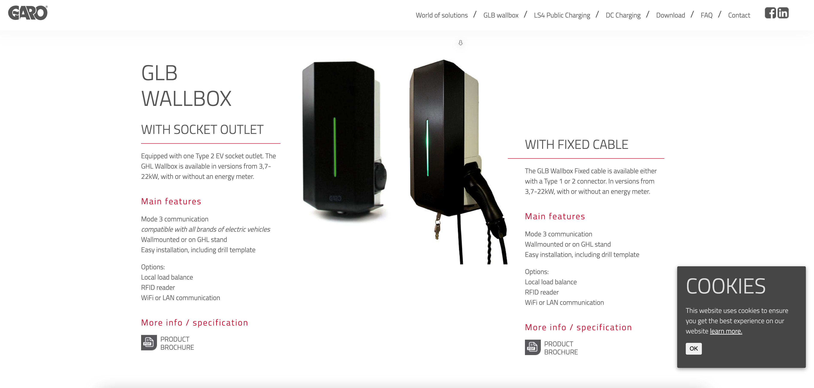
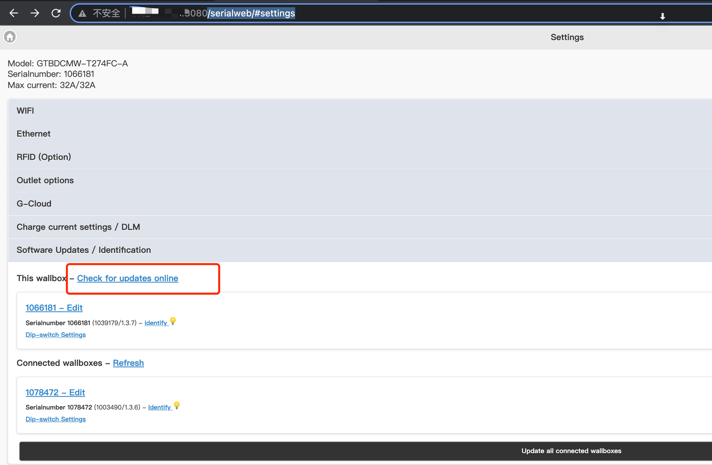
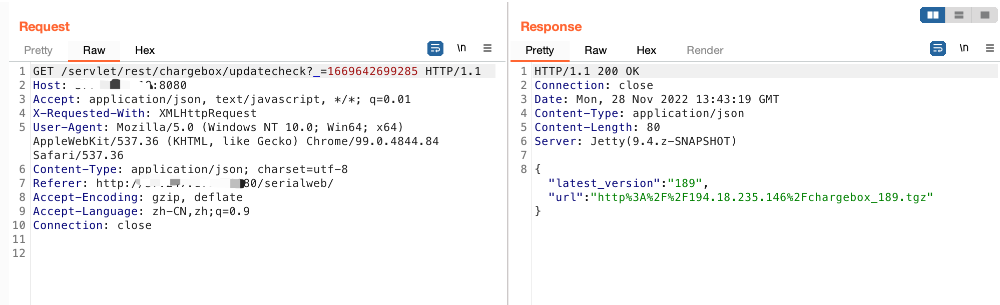
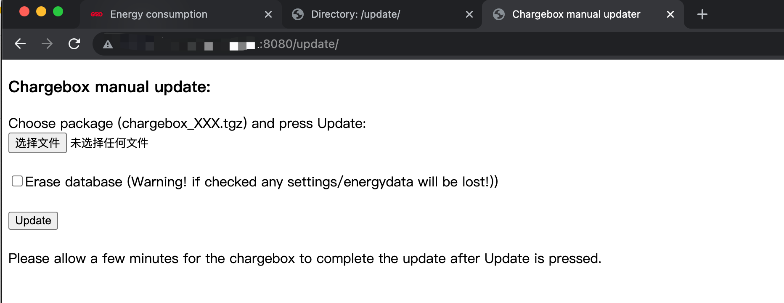
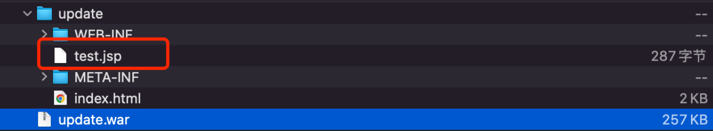
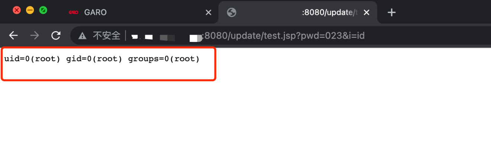

# Garo Web Console Getshell

## CVE-ID

**CVE-2023-30399**

https://cve.mitre.org/cgi-bin/cvename.cgi?name=CVE-2023-30399

## Vendors

http://garocharging.com/glb-wallbox/
https://www.garo.se/



## Description

GARO Wallbox series products are a type of charging pile products for the Internet of Things.

The web console of GARO GLB Wallbox series products has unauthorized access to the update interface. From the setting page, you can obtain the firmware address and update the SoftWare permissions. Obtain device management permissions by deploying the Tomcat war package in the custom update package.

**Vendor of the products:**  GARO Wallbox GLB/GTB/GTC

**Vulnerable Version**: <=189

**Vulnerability Type**: Remote code execution

**Proof of concept**: Firmware update API without authentication

## Vulnerability Details

The firmware address can be obtained on this page（http://target:8080/serialweb/#settings）, and a man-in-the-middle attack can be used to modify the address to a malicious update package link.



The firmware update address and the latest version are as follows:



Download the firmware update package and analyze the directory structure：

`chargebox_189.tgz`

```
├── META-INF
│   └── MANIFEST.MF
├── PENDING_UPDATE
├── SerialService.jar
├── cacerts
├── chargebox_firmware.bin
├── chargebox_firmware_1E9703.bin
├── chargebox_firmware_1E9801.bin
├── checkonline
├── checkusbhdd
├── config.txt_img
├── default
├── dnsmasq.conf
├── downloadandupdate.sh
├── factoryreset
├── hostapd.conf_img
├── hosts
├── init_firmware.bin
├── iptables.ipv4.forward
├── java.security
├── log
├── log4j.properties
├── prepimage.sh
├── rebuilddatabase
├── resetifoffline
├── restarteth.sh
├── rfidbackup.war
├── serialservice
├── serialweb.war
├── support.sh
├── switchwifi
├── switchwifi_new
├── tzdata-latest.tar.gz
├── tzupdater.jar
├── update
│   ├── META-INF
│   │   └── MANIFEST.MF
│   ├── WEB-INF
│   │   ├── classes
│   │   │   ├── UpdaterServlet.class
│   │   │   └── UploadServlet.class
│   │   └── lib
│   │       ├── commons-fileupload-1.3.2.jar
│   │       └── commons-io-2.5.jar
│   ├── index.html
│   └── test.jsp
├── update.war
├── update189.sh
├── updaterscript.sh
├── wpa_supplicant.conf_img
└── ziplogs
```

Analyze update.war to get the logic of remote update and local update.

The local update interface can be accessed without authentication.



Therefore, attackers can construct malicious update packages to execute commands and obtain device permissions.

The uploaded Chargebox_189.tgz update package contains a malicious update.war, and everything else remains unchanged.



A malicious update package is uploaded on the update interface. After the update is completed, the test.jsp constructed by the attacker is deployed to the device service.

